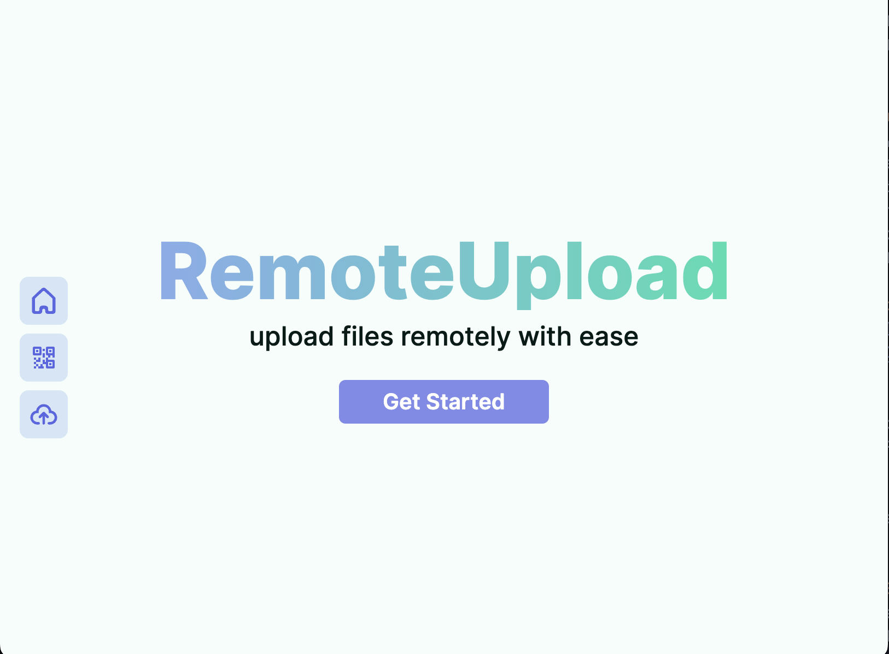

# Remote Upload

File sharing website which allows you to transfer files from a PC straight to your email w/o any login.

## Features

- Privacy first: we don't store any user files on our servers
- No Login required: you don't need to create an account to upload files
- Easy to use: just upload a file and scan the QR code from logged in device

## How to use

- Go to [remoteupload.vercel.app](https://remoteupload.vercel.app)
- Upload files: you can upload files by clicking on the upload button or by dragging and dropping files on the page
- Scan QR code: scan the QR code from your phone or any other device after logging in with Google
- Download files: An email will be sent to you with the attached files

## Tech Stack

- Next.js
- UploadThing
- ShadCN UI
- Resend email

> Note: This project is still in development and some features may not work as expected.

## Known Issues

- Only one file can be uploaded at a time, but multiple files can be shared at once

## License

[MIT](LICENSE)
